# robot_path_planner_public
## 1. Environment Requirements
<p align="center">
    
    
</p>

- Ubuntu 20.04 LTS (Recommended)
- ROS Noetic 
- Dependencies:`ros-noetic-osqp`, `ros-noetic-gmapping`, `ros-noetic-map-server`, `ros-noetic-rviz`, `libeigen3-dev`

## 1.1 Build (Conan + catkin)

Third-party libraries are managed via Conan (`3rd/`). On a fresh build or a new machine, run the Conan install step first to generate `3rd/conanbuildinfo.cmake` and related files; otherwise you may see missing dependency errors (e.g., `find_package(osqp)` cannot be resolved). Detailed steps are provided below.

```bash
cd /path/to/robot_path_planner_public
./scripts/build.sh
```

## 2. Project Overview

> Note: This repository is developed for experiments and secondary development on top of the open-source framework [ros_motion_planning](https://github.com/ai-winter/ros_motion_planning). It is maintained in the open following community best practices and is still under active development; issues and PRs are welcome.

<p align="center">
  
  <br />
  <em>Figure 1: Program Logo GIF</em>
</p>

This repository is a modular, reproducible workspace for mobile robot navigation and motion planning (ROS1/Noetic). It provides a LEGO-like set of interchangeable building blocks—costmap plugins, global/local planners, controllers, and trajectory optimizers—together with simulation assets and configuration templates. The focus is to reduce environment/setup friction so you can spend time on algorithm understanding, reproduction, secondary development, and apples-to-apples comparisons by swapping modules and tuning parameters within the same ROS navigation stack.

In addition, it includes a set of engineering-driven extensions at both the **module** level and the **system** level (see **Module Gallery** and **Core Innovations** below):

- Module-level (building blocks): multiple global planners / local planners / controllers / layers / optimizers that can be composed as needed, with implementation notes in `docs/` and parameter examples in `src/sim_env/config/`.
- System-level (reference stacks): representative integrated pipelines and case studies such as HPCC, HLP/HLPMPC(+Corridor), reachability-aware planning & control (Reachability Layer + A* + MPPI/MPPI-like), Sunshine (ray sampling + MINCO + iLQR), ST-Planner (space–time Hybrid A* + probability layer + iLQR), and a socially-aware planning/control stack with SocialLayer.

The overall goal is to provide a LEGO-like toolbox that makes it easy to (1) build your own stacks from reusable pieces, (2) reproduce and compare algorithms under the same wiring, and (3) keep accumulating improvements as modular components.

**Roadmap (planned)**
- Real-robot deployment notes and reproducible bring-up configs (hardware/time sync, sensor drivers, frames).
- Benchmark & regression tooling: batch runs, logging, metrics extraction, and statistical comparison scripts.
- More “code-to-paper” mappings in `docs/` (derivations, implementation notes, parameter sensitivity).

Below is a typical system architecture diagram used in this repository:

<p align="center">
    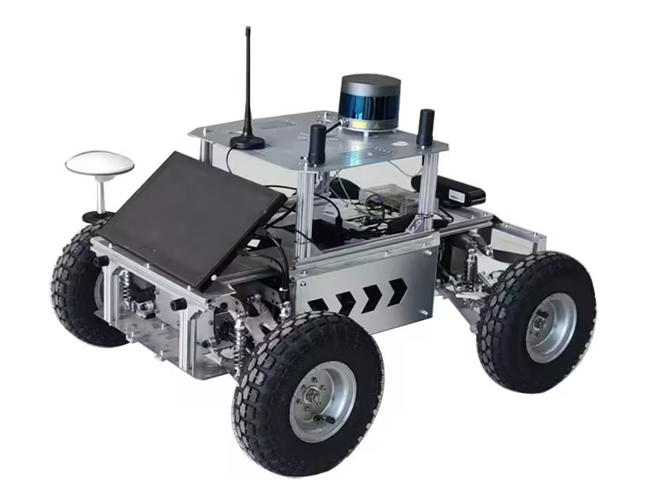
  <br />
  <em>Figure 2: Robot</em>
</p>

## 3. Module Gallery

This section is a catalog of the core modules in the repository (planners / controllers / layers / optimizers), grouped by functionality. Each card provides a one-line summary, an entry path, and a demo GIF (recommended size: 400×327 or proportional scaling).

> **Note**
> This repository is developed on top of the open-source framework `ros_motion_planning`, but it does not necessarily include every upstream module. In principle, the framework can work with most upstream modules; however, since both projects continue to evolve, details may diverge over time. When porting or mixing modules, be prepared to adjust implementation details (interfaces, parameters, topics, frames, etc.).

> **Note (GIFs & parameters)**
> The demo GIFs are recorded with one set of default parameters in our simulation setup. To reproduce similar behavior in your environment, you will likely need to tune robot limits, costmap settings (resolution/inflation), and planner/controller parameters (horizon, weights, sampling, etc.).

### 3.1 Global Planning Modules

<table>
    <tr>
        <td align="center" width="33%">
            <b>rhcf_planner</b><br/>
            <em>Voronoi multi-homotopy global planner (RHCF-style).</em><br/>
            <code>src/core/path_planner/path_planner/src/graph_planner/</code><br/>
            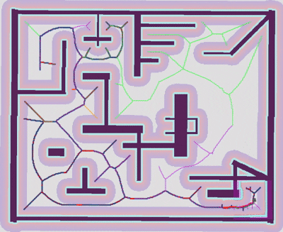
        </td>
        <td align="center" width="33%">
            <b>bdrp_planner</b><br/>
            <em>Sampling-based global planner with lightweight refinement.</em><br/>
            <code>src/core/path_planner/path_planner/src/sample_planner/</code><br/>
            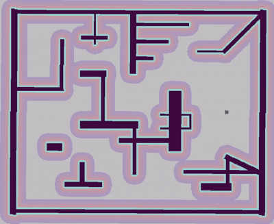
        </td>
        <td align="center" width="33%">
            <b>sunshine_planner</b><br/>
            <em>Sunshine ray sampling + LOS graph search global planner.</em><br/>
            <code>src/core/path_planner/path_planner/src/sample_planner/</code><br/>
            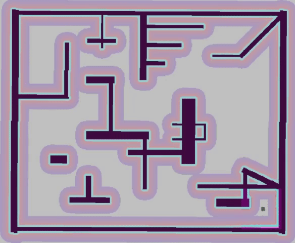
        </td>
    </tr>
</table>

> **Note**
> Besides the three highlighted global planners above, this repository also includes (or can be configured to use) a broader set of global planners, such as GBFS, Dijkstra, A*, Hybrid A*, RRT, RRT*, Informed RRT*, and Voronoi-based planners. See `src/user_config/user_config.yaml` and `src/sim_env/config/planner/` for planner IDs and parameter templates.

### 3.2 Local Planning / Control Modules

<table>
    <tr>
        <td align="center" width="33%">
            <b>hlpmpccorridor_local_planner</b><br/>
            <em>HLP + MPC + convex corridor local planning.</em><br/>
            <code>src/core/controller/hlpmpccorridor_local_planner/</code><br/>
            
        </td>
        <td align="center" width="33%">
            <b>bubble_local_planner</b><br/>
            <em>Reactive local planner (bubble-style obstacle avoidance).</em><br/>
            <code>src/core/controller/bubble_local_planner/</code><br/>
            
        </td>
        <td align="center" width="33%">
            <b>ilqr_controller</b><br/>
            <em>Model-based iLQR tracking controller.</em><br/>
            <code>src/core/controller/ilqr_controller/</code><br/>
            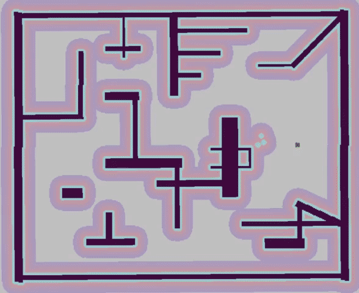
        </td>
    </tr>
    <tr>
        <td align="center" width="33%">
            <b>karcher_local_planner</b><br/>
            <em>Local planner using Karcher mean / manifold smoothing.</em><br/>
            <code>src/core/controller/karcher_local_planner/</code><br/>
            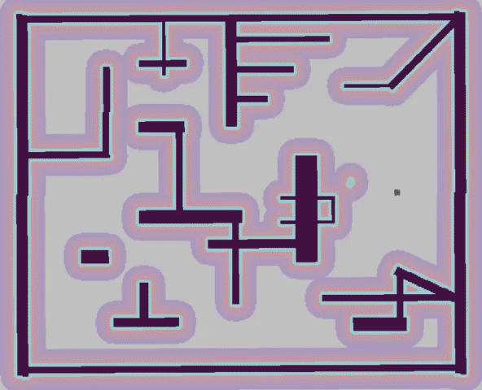
        </td>
        <td align="center" width="33%">
            <b>minco_local_planner</b><br/>
            <em>MINCO-based local planning & tracking.</em><br/>
            <code>src/core/controller/minco_local_planner/</code><br/>
            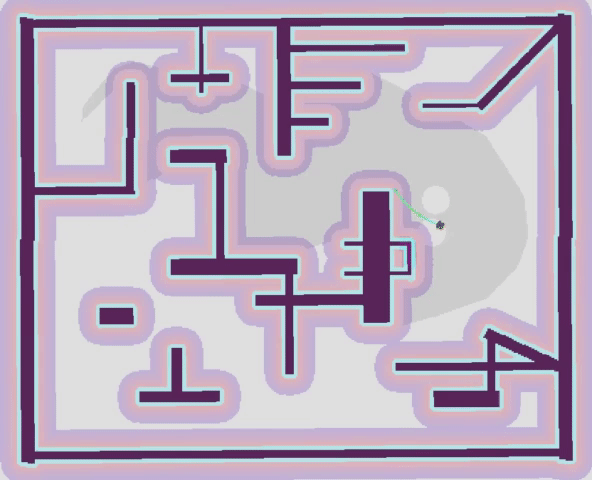
        </td>
        <td align="center" width="33%">
            <b>mppi_local_planner</b><br/>
            <em>Sampling-based MPPI local planner.</em><br/>
            <code>src/core/controller/mppi_local_planner/</code><br/>
            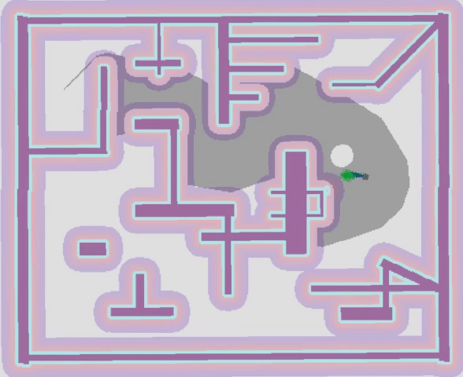
        </td>
    </tr>
    <tr>
        <td align="center" width="33%">
            <b>reachability_controller</b><br/>
            <em>Reachability-aware MPPI controller.</em><br/>
            <code>src/core/controller/reachability_controller/</code><br/>
            
        </td>
        <td align="center" width="33%">
            <b>st_hybrid_astar_local_planner</b><br/>
            <em>Space–time Hybrid A* local planner.</em><br/>
            <code>src/core/controller/st_hybrid_astar_local_planner/</code><br/>
            
        </td>
        <td align="center" width="33%">
            <b>tangent_local_planner</b><br/>
            <em>Tangent graph / tangent sampling local planner.</em><br/>
            <code>src/core/controller/tangent_local_planner/</code><br/>
            
        </td>
    </tr>
    <tr>
        <td align="center" width="33%">
            <b>vfh_local_planner</b><br/>
            <em>Vector Field Histogram (VFH) reactive local planner.</em><br/>
            <code>src/core/controller/vfh_local_planner/</code><br/>
            
        </td>
        <td align="center" width="33%"></td>
        <td align="center" width="33%"></td>
    </tr>
</table>

> **Note**
> Besides the highlighted local planning/control modules above, the platform also supports classic controllers and planners such as PID / MPC / LQR / APF, as well as widely used ROS navigation plugins like DWA and TEB (when the corresponding ROS packages are available). See `src/user_config/user_config.yaml` for the selectable controller/planner IDs.

### 3.3 Trajectory Optimization Modules

<table>
    <tr>
        <td align="center" width="50%">
            <b>lbfgs</b><br/>
            <em>Trajectory smoothing via L-BFGS(-Lite).</em><br/>
            <code>src/core/trajectory_planner/src/trajectory_optimization/lbfgs_optimizer/</code><br/>
            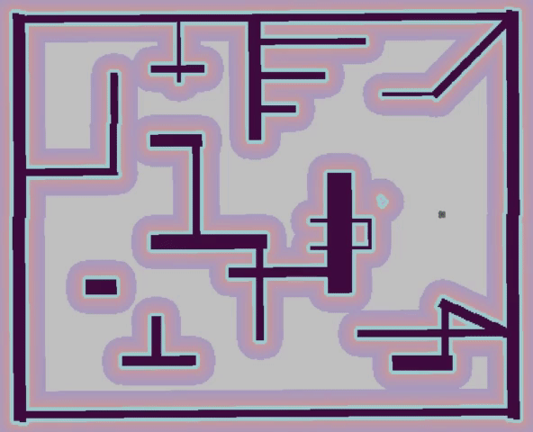
        </td>
        <td align="center" width="50%">
            <b>minco</b><br/>
            <em>MINCO-like minimum-jerk spline optimizer.</em><br/>
            <code>src/core/trajectory_planner/src/trajectory_optimization/minco_spline_optimizer/</code><br/>
            
        </td>
    </tr>
    <tr>
        <td align="center" width="50%">
            <b>minimum-snap</b><br/>
            <em>QP-based minimum-snap optimizer (corridor constraints supported).</em><br/>
            <code>src/core/trajectory_planner/src/trajectory_optimization/minimumsnap_optimizer/</code><br/>
            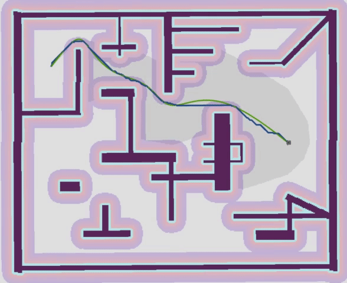
        </td>
        <td align="center" width="50%">
            <b>splinetrajectory</b><br/>
            <em>Spline trajectory optimizer (global reference smoothing).</em><br/>
            <code>src/core/trajectory_planner/src/trajectory_optimization/splinetrajectory_optimizer/</code><br/>
            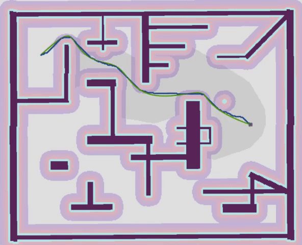
        </td>
    </tr>
    <tr>
        <td align="center" width="50%">
            <b>conjugate_gradient</b><br/>
            <em>Conjugate-gradient trajectory smoothing optimizer.</em><br/>
            <code>src/core/trajectory_planner/src/trajectory_optimization/conjugate_optimizer/</code><br/>
            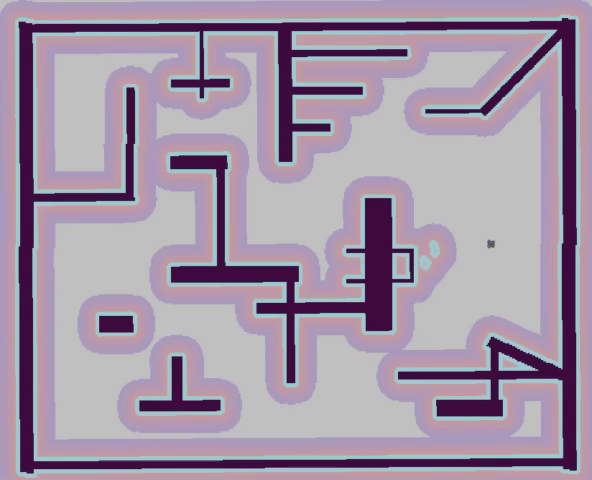
        </td>
        <td align="center" width="50%"></td>
    </tr>
</table>

### 3.4 Map Plugin Modules (costmap layers)

<table>
    <tr>
        <td align="center" width="33%">
            <b>globalreachability_layer</b><br/>
            <em>Global reachability scoring layer.</em><br/>
            <code>src/plugins/map_plugins/globalreachability_layer/</code><br/>
            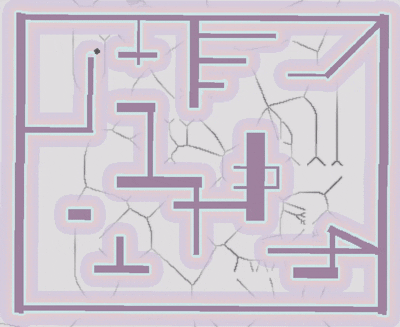
        </td>
        <td align="center" width="33%">
            <b>localreachability_layer</b><br/>
            <em>Robot-conditioned local reachability layer.</em><br/>
            <code>src/plugins/map_plugins/localreachability_layer/</code><br/>
            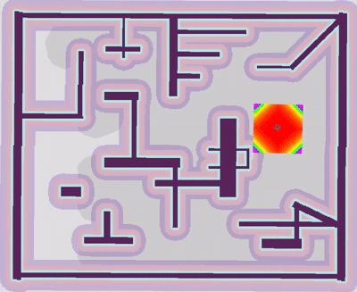
        </td>
        <td align="center" width="33%">
            <b>social_layer</b><br/>
            <em>Pedestrian social comfort cost layer.</em><br/>
            <code>src/plugins/map_plugins/social_layer/</code><br/>
            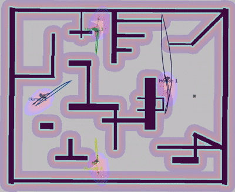
        </td>
    </tr>
    <tr>
        <td align="center" width="33%">
            <b>rc_esdf_layer</b><br/>
            <em>ESDF-like distance / cost field layer.</em><br/>
            <code>src/plugins/map_plugins/rc_esdf_layer/</code><br/>
            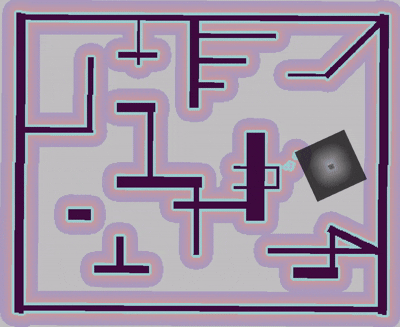
        </td>
        <td align="center" width="33%">
            <b>pseudodistance_layer</b><br/>
            <em>Pseudo-distance field layer (fast distance proxy).</em><br/>
            <code>src/plugins/map_plugins/pseudodistance_layer/</code><br/>
            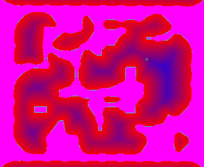
        </td>
        <td align="center" width="33%">
            <b>distance_layer</b><br/>
            <em><b>[Upstream: ros_motion_planning]</b> ESDF / distance utilities & costmap layer.</em><br/>
            <code>src/plugins/map_plugins/distance_layer/</code><br/>
            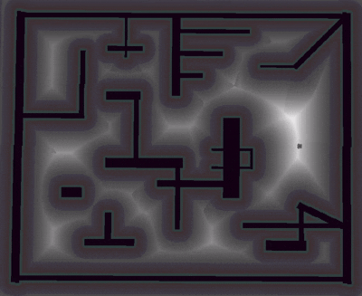
        </td>
    </tr>
    <tr>
        <td align="center" width="33%">
            <b>voronoi_layer</b><br/>
            <em><b>[Upstream: ros_motion_planning]</b> Voronoi costmap layer (dynamic voronoi).</em><br/>
            <code>src/plugins/map_plugins/voronoi_layer/</code><br/>
            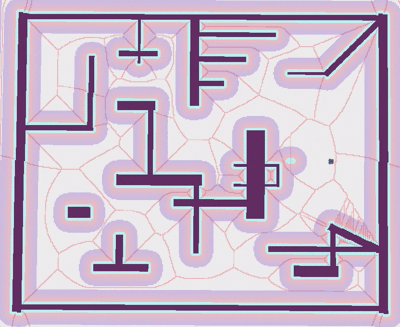
        </td>
        <td align="center" width="33%"></td>
        <td align="center" width="33%"></td>
    </tr>
</table>

### 3.5 Other Plugins / Third-party

<table>
    <tr>
        <td align="center" width="50%">
            <b>gazebo_plugins / pedsim_msgs</b><br/>
            <em>Pedestrian simulation, tracking messages and related plugins.</em><br/>
            <code>src/plugins/gazebo_plugins/</code><br/>
            
        </td>
        <td align="center" width="50%"></td>
    </tr>
</table>

**Third-party dependencies (text-only)**

- `3rd/`: vendored dependencies and upstream references (e.g., LBFGS-Lite, MINCO upstream).
- Third-party builds are managed via Conan; see `scripts/build.sh` and the notes in **1.1 Build (Conan + catkin)**.

### 3.6 Maps / Simulation Scenes (text-only)

This repository includes a diverse set of simulation assets for evaluation and regression testing:

- 2D occupancy maps: `src/sim_env/maps/`
- Gazebo worlds / models: `src/sim_env/worlds/`, `src/sim_env/models/`, `src/sim_env/meshes/`

The map collection covers multiple styles (multi-wall mazes, museum-like indoor layouts, warehouse/storage scenes, outdoor residential/villa neighborhoods, etc.). Most maps are collected from public online sources and are used to provide varied test cases rather than to showcase map novelty.

## 4. Core Innovations

This chapter is a set of system-level reference pipelines: using the modules (building blocks) from **Module Gallery**, we assemble integrated planning and control stacks within the same ROS1 navigation stack and simulation setup, and summarize the key system-level design decisions. Each subsection corresponds to a reproducible pipeline (with a demo GIF slot).

If you mainly want the module inventory and entry points, start with **Module Gallery**. If you mainly want to run and reproduce experiments, the **Repository Structure** / **Build & Run** sections provide package paths and script entry points. More detailed derivations and parameter explanations are collected in `docs/`.
### 4.1 Global Hierarchical Motion Planning for Ackermann Robots (HPCC)

<p align="center">
    
</p>

A hierarchical global planning method combining path search, corridor construction, and convex optimization to generate kinodynamically feasible trajectories.

#### Key Steps
- Sparse Initial Path Generation: Fusion of A* algorithm with Ramer-Douglas-Peucker (RDP) path compression to eliminate redundant waypoints. The RDP operator (radial deviation threshold = 0.25) reduces waypoint count by 81.6% compared to raw A*, minimizing backend optimization load.
- Dynamic Corridor Inflation: Integrates Ackermann steering kinematics (minimum turning radius constraint) and convex decomposition to construct adaptive convex safety corridors, limiting trajectory randomness.
- Convex Optimization Formulation: Formulates trajectory generation as a convex optimization problem with safety corridor constraints (linear inequalities) and a cost function minimizing the second derivative of acceleration (snap).
- Curvature-Adaptive Time Redistribution: Dynamically adjusts time parameters based on trajectory curvature to ensure kinodynamic feasibility.

#### Core Formulas
Objective Function:

$$
\min \int_{0}^{T} \dddot{\mathbf{x}}(t)^2 \, dt
$$

where $\dddot{\mathbf{x}}(t)$ denotes the snap (third derivative of position).

Ackermann Kinematic Constraints:

$$
\begin{cases}
 x_{i+1} = x_i + v_i \Delta T_i \cos(\theta_i) \\
 y_{i+1} = y_i + v_i \Delta T_i \sin(\theta_i) \\
 θ_{i+1} = θ_i + ω_i Δ T_i
\end{cases}
$$

with minimum turning radius

$$
R_{\text{min}} = \frac{L}{\tan(\delta_{\text{max}})}
$$

where $L$ is the wheelbase and $\delta_{\text{max}}$ the maximum steering angle.

Time Scaling Factor:

$$
\mu = \sqrt{\frac{k_{\text{max}}}{|k(s)|}}
$$

### 4.2 Hybrid Local Planner (HLP) Based on Dynamic State Graph

<p align="center">
    
</p>

A sampling-based local planner designed for dynamic obstacle avoidance and real-time responsiveness, solving the "deadlock" issue in extreme orientation scenarios.

#### Key Steps
- Dynamic State Graph Construction: Builds a layered graph (20 layers × 60 nodes) with sampling based on robot kinematics (velocity/acceleration limits). Nodes encode position and orientation, with edges weighted by Euclidean distance and cost penalties.
- Layered Dijkstra Path Search: Evaluates node costs (obstacle cost + path alignment cost + goal proximity cost) to generate geometrically feasible local paths.
- Obstacle-Aware Velocity Allocation: Dynamically adjusts linear velocity based on obstacle density and kinodynamic constraints, avoiding over-acceleration.
- Hybrid A* Angular Velocity Optimization: Refines angular velocity in SE(2) space to ensure smooth steering and eliminate in-place oscillation.

#### Core Formulas
Node Cost Function:

$$
C_{\text{total}} = \alpha C_{\text{obs}} + \beta C_{\text{path}} + \gamma C_{\text{goal}}
$$

where $\alpha, \beta, \gamma$ are weighting factors for obstacle avoidance, path alignment, and goal proximity.

Allowed Linear Velocity:

$$
v_{\text{allow}} = v_{\text{max}} \cdot s,
\quad
s = \begin{cases}
1, & C_{\text{obs}} < C_{\text{thr}} \\
\\frac{C_{\text{max}} - C_{\text{obs}}}{C_{\text{max}} - C_{\text{thr}}}, & C_{\text{obs}} \geq C_{\text{thr}}
\end{cases}
$$

Layer Orientation Step:

$$
\Delta \theta_{\text{layer}} = \frac{2\theta_{\text{range}}}{N-1}
$$

Angular Velocity Calculation:

$$
\omega = \frac{\Delta \theta}{\Delta t / 2}
$$

### 4.3 HLPMPC: Hybrid Control with HLP + Short-Horizon MPC

<p align="center">
    
</p>

An enhanced variant of HLP integrating model predictive control for smoother velocity profiles and improved tracking performance.

#### Key Steps
- Parallel Control Paths: Runs HLP (geometric feasibility) and MPC (dynamic smoothing) in parallel.
- Sparse QP Formulation: MPC optimizes velocity sequences (linear + angular) over a short horizon (N=5-10) using OSQP solver. The QP problem minimizes tracking error and velocity smoothness.
- Soft Blending Strategy: Uses a sigmoid function to compute continuous blending weights, avoiding abrupt control switches between HLP and MPC.
- Hierarchical Fallback Mechanism: Degrades to a simple lookahead proportional controller if MPC fails (infeasible solution/timeout).

#### Core Formulas
MPC Objective Function:

$$
J = \sum_{k=0}^{N-1} \left( q_v (v_k - v_{\text{ref}})^2 + q_\omega (\omega_k - \omega_{\text{ref}})^2 \right)
\\
\quad + \sum_{k=1}^{N-1} \left( r_v \Delta v_k^2 + r_\omega \Delta \omega_k^2 \right)
$$

Blending Weight Target:

$$
\alpha_{\text{target}} = \frac{1}{1 + \exp\bigl(-k\, (|v_{\text{MPC}} - v_{\text{HLP}}| - \tau)\bigr)}
$$

Filtered Blending Weight:

$$
\alpha_{\text{filtered}} = \alpha_{\text{prev}} + \gamma (\alpha_{\text{target}} - \alpha_{\text{prev}})
$$

### 4.4 HLPMPCCorridor: HLPMPC with Local Convex Safety Corridors

<p align="center">
    
</p>

Integrates convex safety corridors into HLPMPC for enhanced geometric feasibility and collision avoidance.

#### Key Steps
- Corridor Construction: Decomposes the global path into a sequence of convex polygons via:
    - Initial polygon generation based on robot dimensions (width + safety margin).
    - Obstacle query using KD-tree for efficient neighborhood search.
    - Ellipse iteration to exclude collision points and refine corridor boundaries.
- Trajectory Feasibility Check: Rejects trajectories that exit the convex corridor (each sampled point must lie within at least one polygon).
- Integration with HLPMPC: Uses corridor constraints to prune unsafe candidate trajectories before blending.

#### Core Formulas
Corridor Boundary Constraint:

$$
\mathbf{n}_i^T (\mathbf{x}(t) - \mathbf{p}_i) \leq d_i, \quad \forall i
$$

Safety Corridor Inclusion:

$$
\mathbf{x}(t) \in \bigcup_{i=1}^{M} C_i \subseteq F_{\text{free}}
$$

### 4.5 Socially-Aware Hierarchical Planning (HLP + MPC + Social Layer + Convex Corridors)

<p align="center">
    
</p>

Based on the HLP / HLPMPC / HLPMPCCorridor building blocks above, this module organizes them into a full hierarchical system that also reasons about pedestrians and dynamic obstacles. A global Hybrid A* + LBFGS + corridor planner provides a coarse but robust path; a local HLP + short-horizon MPC controller refines it; a dedicated SocialLayer encodes human comfort and interaction constraints.

#### Key Steps
- Global hybrid planner with corridors: use Hybrid A* on the grid map with Voronoi-based potential, RDP compression and LBFGS smoothing to generate a coarse path; decompose the free space around it into convex safety corridors shared by both global and local modules.
- Local HLP + MPC cooperation: HLP's dynamic state graph quickly proposes candidate motion primitives, while a sparse QP-based MPC (Section 4.3) optimizes velocity sequences under kinodynamic and corridor constraints; a blending logic selects between HLP, MPC and a pure-pursuit fallback.
- Social and dynamic obstacle modeling: a separate `social_layer` builds an anisotropic costmap around pedestrians (e.g., elongated ellipses in front, smaller lobes behind), using predicted trajectories from `pedsim_msgs`; social costs are aggregated but kept distinct from hard collision costs.
- Event-triggered replanning: violations of corridor / social comfort or large MPC tracking errors can trigger a new global plan, closing the loop between global, local and social reasoning.

#### Core Formulas
Social-layer cost around a pedestrian $p$ (conceptual anisotropic Gaussian in the pedestrian heading frame):

$$
\begin{aligned}
\begin{bmatrix}\tilde x \\ \tilde y\end{bmatrix}
&= R(-\psi_p)\bigl(x - p\bigr),\\
d_{\text{ell}}(x;p) &= \sqrt{\frac{\tilde x^2}{a^2} + \frac{\tilde y^2}{b^2}},\\
J_{\text{social}}(x) &= \sum_p w_p \exp\!\bigl(-\tfrac12 d_{\text{ell}}(x;p)^2\bigr),
\end{aligned}
$$

where $R(-\psi_p)$ rotates into the pedestrian's heading frame and $a,b$ control front/back radii.

Blended control between HLP and MPC:

$$
u = (1-\alpha)\,u_{\text{HLP}} + \alpha\,u_{\text{MPC}},\quad \alpha\in[0,1].
$$

For a full system-level description and derivations, see `docs/hlpmpccorridor_paper_hlp_social_corridor_mpc_hybrid_v2.md`.

### 4.6 Reachability-Aware Planning (Reachability Layers + A* + MPPI)

<p align="center">
    
</p>

A reachability-aware navigation pipeline that augments traditional costmap-based planning with an explicit “passability / bottleneck” score. The reachability signal is injected into both global search (A* + minimum-snap trajectory optimization) and local control (MPPI), so that the system naturally prefers wide, robust corridors over narrow bottlenecks.

#### Key Steps
- Global reachability layer (`globalreachability_layer`): from the global master costmap and, optionally, a Voronoi skeleton, compute clearance, available width and "ridge" factors, compress them into $[0,1]$ scores via $\mathrm{cont01}$, and aggregate into a global reachability map $R_g$.
- Reachability-aware global path planner (`ReachabilityPathPlanner`): run A* on the grid while (i) hard-pruning cells with $R_g < R_{\min}$ and (ii) adding a soft penalty proportional to $(1-R_g)$ to the usual costmap cost.
- Minimum-snap trajectory optimization in corridors (`ConvexSafetyCorridor` + `MinimumsnapOptimizer`): given a grid path, decompose free space into convex polygons and solve a QP that minimizes snap under corridor half-space constraints, generating a smooth global trajectory.
- Local reachability layer (`localreachability_layer`): in the robot-centric window, compute a point-wise desirability $r(x)$ from local costmap / free width, and propagate it with a widest-path (maximin) update to obtain a robot-conditioned reachability field $R_\ell$.
- Reachability-aware MPPI controller (`reachability_controller`): use the inflated local costmap as a hard collision indicator and combine $R_\ell$ into both hard constraints (`min_reachability`) and a soft critic that rewards trajectories with higher average reachability.

#### Core Formulas
Continuous compression used in reachability scoring:

$$
\mathrm{cont01}(\Delta;s)=\frac{\max(0,\Delta)}{\max(0,\Delta)+s}
$$

One typical global reachability aggregation (clearance/width/ridge factors):

$$
R_g(x)=\mathrm{clip}_{[0,1]}\Big( s_c(x)^{\alpha_c}\cdot s_w(x)^{\alpha_w}\cdot s_r(x)^{\alpha_r} \Big)
$$

Robot-conditioned local reachability via widest-path (maximin) propagation:

$$
R_\ell(x)=\max_{p\in\mathcal{P}(s\to x)}\ \min_{y\in p}\ r(y)
$$

MPPI weighting and update (numerically-stable form):

$$
w_k\propto \exp\left(-\frac{S_k-\min_j S_j}{\lambda}\right),\quad \sum_k w_k=1
$$

Reachability critic (soft preference) used in rollout evaluation:

$$
S\mathrel{+}=w_{\text{reach}}\cdot (1-\bar R_\ell)
$$

For full implementation-level details and parameter entry points, see `docs/reachability_planner.md`.

### 4.7 Sunshine Planner: Sunshine Ray Sampling + MINCO + iLQR

<p align="center">
    
</p>

A hierarchical motion-planning framework for grid maps that combines geometry-aware Sunshine sampling, minimum-jerk global trajectory optimization and model-based local optimal control. It is particularly suitable for cluttered indoor environments with narrow gaps and long corridors.

#### Key Steps
- Sunshine ray sampling: perform 360° ray casting on the occupancy grid to measure free-space “sunlight” distances, and extract tangent / corner-like keypoints where free-space length varies sharply; connect visible keypoints with line-of-sight (LOS) edges to build a sparse Sunshine graph.
- Global search on Sunshine graph: run A* on the Sunshine graph to obtain an initial collision-free waypoint sequence $\pi_0$ that already encodes good homotopy choices.
- Global trajectory optimization (MINCO-style minimum-jerk spline): parameterize the trajectory as piecewise polynomials with control points $\{\mathbf{q}_i\}$ and solve a minimum-jerk problem under boundary, continuity and (optional) corridor constraints to obtain a smooth trajectory $\pi^*$.
- Local optimization & control (iLQR): use an iLQR controller with unicycle dynamics to track $\pi^*$, combining tracking cost, control effort, smoothness and obstacle costs from an ESDF (`distance_layer`) and convex corridors; failures can trigger event-based replanning on the Sunshine graph.

#### Core Formulas
Ray directions for a 360° scan:

$$
\phi_i = \frac{2\pi i}{N},\quad i=0,1,\dots,N-1
$$

Ray-cast free-space length (conceptual form):

$$
d(\phi_i)=\min\{r\ge 0\mid \mathrm{occupied}(x_0+r[\cos\phi_i,\sin\phi_i])=1\}
$$

MINCO-style minimum-jerk objective (conceptual form):

$$
\min_{\{\mathbf{q}_i\}}\ \sum_{k=0}^{K-1}\int_{0}^{T_k} \left\|\dddot{\mathbf{x}}_k(t)\right\|^2 dt
$$

subject to boundary, continuity and (optionally) corridor constraints.

iLQR objective and dynamics (standard form):

$$
\min_{\{u_t\}}\ \sum_{t=0}^{T-1} \ell(x_t,u_t)+\ell_T(x_T),\quad x_{t+1}=f(x_t,u_t)
$$

For implementation mapping (code/config) and detailed derivations aligned with this repository, see `docs/sunshine_planner.md`.

### 4.8 ST-Planner: Space–Time Hybrid A* + Probability Layer + iLQR

<p align="center">
    
</p>

A space–time-aware navigation pipeline that extends 2D planning to a 4D state $(x,y,\theta,t)$. It combines a global spline trajectory, a space–time Hybrid A* local planner, a time-varying probability layer for dynamic obstacles and an iLQR tracker to generate socially compliant motions in dynamic environments.

#### Key Steps
- Global path and spline trajectory: a Voronoi / RHCF-style global planner finds a collision-free topological path; a spline / minimum-jerk optimizer turns it into a smooth time-parameterized reference.
- ST-Hybrid-A* local planner: in the local window, perform a 4D state-space search in $(x,y,\theta,t)$ (standard A* or weighted A* via $\epsilon(t)$; optional ARA* via `use_ara_star`). In this repository’s default ST profile (`st_hybrid_astar_local_planner_all_on_weighted.yaml`), action-sequence warm-start is enabled (`use_action_warm_start`, `warm_start_seed_open`) to reuse the previous cycle and reduce expansions/jitter.
- ST probability layer (`STProbabilityLayer`): from tracked pedestrians and other dynamic obstacles, build a time-varying probability field $p(x,y,t)$ using constant-velocity prediction and Gaussian-like occupancy kernels; this field is queried during search and control.
- Time-varying safety corridors: carve a static convex corridor around the global path and further cut it in space–time according to dynamic obstacle predictions, encouraging the robot to yield or overtake in socially reasonable ways.
- iLQR tracking controller: use a bicycle/unicycle-model iLQR to track the selected ST trajectory, with costs for path tracking, heading, control effort, smoothness, obstacle / corridor violation and risk from $p(x,y,t)$.

#### Core Formulas
ST-Hybrid-A* successor update (unicycle model with explicit time state):

$$
\begin{aligned}
x_{k+1} &= x_k + v_k \cos\theta_k\,\Delta t,\\
y_{k+1} &= y_k + v_k \sin\theta_k\,\Delta t,\\
θ_{k+1} &= θ_k + ω_k Δ t,\\
t_{k+1} &= t_k + \Delta t.
\end{aligned}
$$

Per-step cost used in search (simplified):

$$
c_k =
w_{\text{len}}\Delta s_k
+w_{\text{time}}\Delta t
+w_{\text{curv}}|\omega_k|
+w_{\text{rev}}\mathbf{1}[v_k<0]
+w_{\text{risk}}\,p(x_k,t_k)
+\cdots
$$

Combined heuristic and ARA* inflation:

$$
h(x) = w_{\text{obs}} h_{\text{obs}}(x)
    +w_{\text{RS}} h_{\text{RS}}(x)
    +w_{\text{turn}} h_{\text{turn}}(x),\qquad
f_\epsilon(x)=g(x)+\epsilon h(x),\ \epsilon\ge 1.
$$

Space–time probability aggregation (conceptual form):

$$
p(x,y,t)=1-\prod_{j}\bigl(1-p_j(x,y,t)\bigr)
$$

Overall tracking cost for iLQR (simplified):

$$
J=\sum_{t}\bigl(
w_{\text{track}}\ell_{\text{track}}(x_t)
+w_{\text{ctrl}}\|u_t\|^2
+w_{\text{smooth}}\|\Delta u_t\|^2
+w_{\text{risk}}\,p(x_t,t)
\bigr).
$$

For a detailed description of algorithms, cost design and parameterization, see `docs/st_planner.md`.

## 5. Repository Structure (accurate and annotated)

```
robot_path_planner_public/
├── src/
│   ├── core/
│   │   ├── controller/                           # local planners / controllers
│   │   │   ├── hlpmpccorridor_local_planner/
│   │   │   ├── bubble_local_planner/
│   │   │   ├── ilqr_controller/
│   │   │   ├── karcher_local_planner/
│   │   │   ├── minco_local_planner/
│   │   │   ├── mppi_local_planner/
│   │   │   ├── reachability_controller/
│   │   │   ├── st_hybrid_astar_local_planner/
│   │   │   ├── tangent_local_planner/
│   │   │   ├── vfh_local_planner/
│   │   │   └── ...
│   │   ├── common/
│   │   │   └── safety_corridor/                  # ConvexSafetyCorridor utilities
│   │   ├── path_planner/
│   │   │   └── path_planner/                     # global planners
│   │   │       ├── src/graph_planner/            # e.g. rhcf_planner
│   │   │       └── src/sample_planner/           # e.g. bdrp_planner, sunshine_planner
│   │   └── trajectory_planner/
│   │       └── src/trajectory_optimization/      # lbfgs / minco / minimum-snap / spline-trajectory
│   ├── plugins/
│   │   ├── map_plugins/                          # costmap layers
│   │   │   ├── globalreachability_layer/
│   │   │   ├── localreachability_layer/
│   │   │   ├── social_layer/
│   │   │   ├── distance_layer/                   # (upstream) ESDF / distance utilities & layer
│   │   │   ├── voronoi_layer/                    # (upstream) Voronoi cost layer
│   │   │   ├── rc_esdf_layer/
│   │   │   ├── pseudodistance_layer/
│   │   │   └── ...
│   │   ├── gazebo_plugins/                       # simulation / pedestrian-related plugins
│   │   └── rviz_plugins/
│   ├── sim_env/                                  # simulation configs / launch / RViz
│   └── ...
├── 3rd/                                          # vendored third-party dependencies
├── scripts/                                      # helper scripts (build/run/stop)
├── docs/                                         # implementation-level notes
├── images/                                       # documentation images / demos
├── build/  devel/                                # catkin build outputs (ignored)
├── LICENSE
└── README.md
```

### 5.1 Module Gallery → code mapping (quick reference)

#### Global planners

Plugin registry: `src/core/path_planner/path_planner/path_planner_plugin.xml`.

| Method | Entry path | Main files |
|---|---|---|
| `rhcf_planner` | `src/core/path_planner/path_planner/src/graph_planner/` | `rhcf_planner.{h,cpp}` |
| `bdrp_planner` | `src/core/path_planner/path_planner/src/sample_planner/` | `bdrp_planner.{h,cpp}` |
| `sunshine_planner` | `src/core/path_planner/path_planner/src/sample_planner/` | `sunshine_planner.{h,cpp}` |

#### Local planning / control

| Method | Package path | Main entry points |
|---|---|---|
| `hlpmpccorridor_local_planner` | `src/core/controller/hlpmpccorridor_local_planner/` | `src/hybrid_planner_ros.cpp`, `src/hybrid_planner.cpp`, `hlpmpccorridor_plugin.xml` |
| `bubble_local_planner` | `src/core/controller/bubble_local_planner/bubble_local_planner/` | `src/bubble_local_planner.cpp`, `bublp_plugin.xml` |
| `ilqr_controller` | `src/core/controller/ilqr_controller/` | `src/ilqr_controller.cpp`, `ilqr_controller_plugin.xml` |
| `karcher_local_planner` | `src/core/controller/karcher_local_planner/` | `src/karcher_local_planner_ros.cpp`, `karcher_local_planner_plugin.xml` |
| `minco_local_planner` | `src/core/controller/minco_local_planner/` | `src/minco_local_planner.cpp`, `minco_local_planner_plugin.xml` |
| `mppi_local_planner` | `src/core/controller/mppi_local_planner/` | `src/mppi_local_planner_ros.cpp`, `mppi_local_planner_plugin.xml` |
| `reachability_controller` | `src/core/controller/reachability_controller/` | `src/reachability_controller.cpp`, `reachability_controller_plugin.xml` |
| `st_hybrid_astar_local_planner` | `src/core/controller/st_hybrid_astar_local_planner/` | `src/st_hybrid_astar_local_planner.cpp`, `st_hybrid_astar_local_planner_plugin.xml` |
| `tangent_local_planner` | `src/core/controller/tangent_local_planner/` | `src/tangent_planner.cpp`, `tangent_local_planner_plugin.xml` |
| `vfh_local_planner` | `src/core/controller/vfh_local_planner/` | `src/vfh_local_planner_ros.cpp`, `VFHlp_plugin.xml` |

#### Trajectory optimization

| Method | Entry path | Main files |
|---|---|---|
| `conjugate_gradient` | `src/core/trajectory_planner/src/trajectory_optimization/conjugate_optimizer/` | `conjugate_optimizer.{h,cpp}` |
| `lbfgs` | `src/core/trajectory_planner/src/trajectory_optimization/lbfgs_optimizer/` | `lbfgs_optimizer.{h,cpp}` |
| `minco` | `src/core/trajectory_planner/src/trajectory_optimization/minco_spline_optimizer/` | `minco_spline_optimizer.{h,cpp}` |
| `minimum-snap` | `src/core/trajectory_planner/src/trajectory_optimization/minimumsnap_optimizer/` | `minimumsnap_optimizer.{h,cpp}` |
| `splinetrajectory` | `src/core/trajectory_planner/src/trajectory_optimization/splinetrajectory_optimizer/` | `splinetrajectory_optimizer.{h,cpp}` |

#### Map plugins (costmap layers)

| Method | Package path | Main files |
|---|---|---|
| `globalreachability_layer` | `src/plugins/map_plugins/globalreachability_layer/` | `src/globalreachability_layer.cpp`, `include/globalreachability_layer/globalreachability_layer.h`, `globalreachability_layer_costmap_plugin.xml` |
| `localreachability_layer` | `src/plugins/map_plugins/localreachability_layer/` | `src/localreachability_layer.cpp`, `include/localreachability_layer/localreachability_layer.h`, `localreachability_layer_costmap_plugin.xml` |
| `social_layer` | `src/plugins/map_plugins/social_layer/` | `src/social_layer.cpp`, `include/social_layer/social_layer.h`, `social_layer_costmap_plugin.xml` |
| `distance_layer` *(upstream: ros_motion_planning)* | `src/plugins/map_plugins/distance_layer/` | `src/distance_layer.cpp`, `include/distance_layer.h`, `distance_layer_costmap_plugin.xml` |
| `voronoi_layer` *(upstream: ros_motion_planning)* | `src/plugins/map_plugins/voronoi_layer/` | `src/voronoi_layer.cpp`, `include/voronoi_layer.h`, `costmap_plugins.xml` |
| `rc_esdf_layer` | `src/plugins/map_plugins/rc_esdf_layer/` | `src/rc_esdf_layer.cpp`, `include/rc_esdf_layer/rc_esdf_layer.h`, `rc_esdf_layer_costmap_plugin.xml` |
| `pseudodistance_layer` | `src/plugins/map_plugins/pseudodistance_layer/` | `src/pseudodistance_layer.cpp`, `include/pseudodistance_layer.h`, `pseudodistance_layer_costmap_plugin.xml` |

#### Other

| Area | Path | Notes |
|---|---|---|
| third-party deps | `3rd/` | vendored dependencies & upstream references |
| simulation / pedestrians | `src/plugins/gazebo_plugins/` | pedestrian simulation, related plugins & messages |

## 6. Build & Run

### Build Examples
#### 6.1 Install [ROS](http://wiki.ros.org/ROS/Installation) (Desktop-Full *suggested*).

#### 6.2 Install git.
    sudo apt install git

#### 6.3 Install dependencies

- OSQP
    ```
    git clone -b release-0.6.3 --recursive https://github.com/oxfordcontrol/osqp
    cd osqp && mkdir build && cd build
    cmake .. -DBUILD_SHARED_LIBS=ON
    make -j6
    sudo make install
    sudo cp /usr/local/include/osqp/* /usr/local/include
    ```
- OSQP-Eigen
    ```
    git clone https://github.com/robotology/osqp-eigen.git
    cd osqp-eigen && mkdir build && cd build
    cmake ..
    make
    sudo make install
    ```
- Other dependencies.
    ```
    sudo apt install python-is-python3 \
    ros-noetic-amcl \
    ros-noetic-base-local-planner \
    ros-noetic-map-server \
    ros-noetic-move-base \
    ros-noetic-navfn
    ```

#### 6.4 Clone the repository
```
git clone https://github.com/SYS-zdk/robot_path_planner_public.git
```

#### 6.5 Compile the code.

    cd robot_path_planner_public/scripts/
    ./build.sh
    # First-time build: use ./build.sh. For subsequent builds you can run catkin_make.
    # Or use catkin build (you may need: sudo apt install python-catkin-tools).
    # Note: since many dependencies are vendored (not installed via apt) and are built from source,
    # build-order issues can happen during incremental rebuilds.
    # Example: social_layer depends on pedsim_msgs; catkin may build social_layer before pedsim_msgs,
    # causing missing generated headers (e.g., TrackedPersons.h).
    # One workaround is to build pedsim_msgs first, e.g.:
    #   catkin_make --cmake-args -DCATKIN_WHITELIST_PACKAGES="pedsim_msgs"
    # Or build in Release:
    #   catkin_make -DCMAKE_BUILD_TYPE=Release
    # Or rerun ./build.sh

### Run Examples

#### 6.6 Execute the code

    cd scripts/
    ./main.sh


#### 6.7 Use **2D Nav Goal** in RViz to select the goal.

#### 6.8  Moving!

#### 6.9  You can use the other script to shutdown them rapidly.
    ./killpro.sh


## 7. Configuration (entry points & tuning workflow)

This repository contains many parameters across planners, controllers, costmaps, and optimizers. Instead of trying to document every knob here, use the following **entry points** to navigate and tune configurations.

### 7.1 Select modules (IDs)

- Primary switchboard: `src/user_config/user_config.yaml` (choose `global_planner`, `local_planner`, and optional `optimizer`).

### 7.2 Where parameters live (templates)

- Central wiring: `src/sim_env/launch/include/navigation/move_base.launch.xml`
    - Loads YAMLs conditionally based on the selected IDs.
- Global planner templates: `src/sim_env/config/planner/*.yaml`
    - Examples: `rhcf_planner_params.yaml`, `sample_planner_params.yaml`, `bdrp_planner_params.yaml`.
- Local planner / controller templates: `src/sim_env/config/controller/*.yaml`
    - Example: `hlpmpccorridor_local_planner.yaml`.
- Trajectory optimization templates: `src/sim_env/config/trajectory_optimization/*.yaml`
    - Examples: `conjugate_gradient_params.yaml`, `lbfgs_params.yaml`, `minco_spline_params.yaml`, `minimumsnap_params.yaml`.
- Robot / costmap templates: `src/sim_env/config/robots/<robot>/*.yaml`
    - Includes local/global costmaps, AMCL, and robot-specific limits.

### 7.3 Practical workflow (recommended)

1. Start from `src/user_config/user_config.yaml` to pick a pipeline.
2. Open `move_base.launch.xml` to see which YAMLs are loaded for that pipeline.
3. Tune in the corresponding YAML(s), focusing first on a small set of high-impact parameters:
     - Robot limits (max velocity/acceleration, steering/turning constraints)
     - Costmap resolution + inflation
     - Controller horizon / time step
     - Optimizer `sample_points` and obstacle/smoothness weights

## 8. References
- ros_motion_planning (upstream framework reference): https://github.com/ai-winter/ros_motion_planning
- OSQP: https://github.com/oxfordcontrol/osqp
- Ramer-Douglas-Peucker Algorithm: https://en.wikipedia.org/wiki/Ramer%E2%80%93Douglas%E2%80%93Peucker_algorithm
- Hybrid A* Algorithm: https://github.com/hku-mars/hybrid_astar
- Convex Safety Corridor Decomposition: https://arxiv.org/abs/1907.08584
- Model Predictive Control for Mobile Robots: https://arxiv.org/abs/2003.09554

## 9. Citation
If you want to learn more about the detailed mathematical derivation of this project or if this project helps your research, please refer to the following citation formats:
- Global Planning Part: 张定坤，梁海朝。基于动态走廊膨胀与凸优化的移动机器人分层运动规划 [J/OL]. 系统仿真学报，1-21 [2026-01-13]. https://link.cnki.net/urlid/11.3092.V.20250916.1349.002.
- Local Planning Part: 张定坤，吴兴涛，梁海朝。基于动态状态图的自主移动机器人混合局部规划方法 [J]. 机器人技术与应用，2025, (05): 20-34.
- Environment Modeling Part: Zhang Dingkun. robot_path_planner_public. [EB/OL]. https://github.com/SYS-zdk/robot_path_planner_public, 2026.

## 10. License
This project is licensed under the GNU General Public License v3.0 (GPL-3.0) — see the LICENSE file for details.
